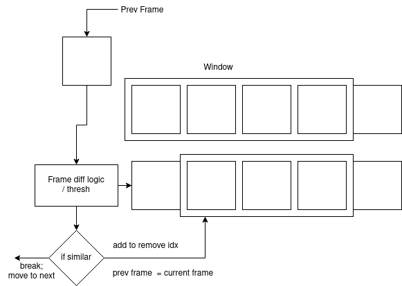
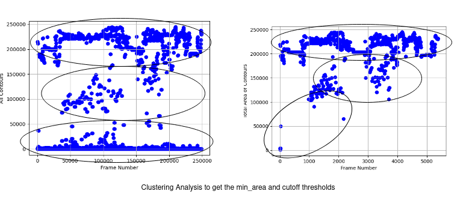
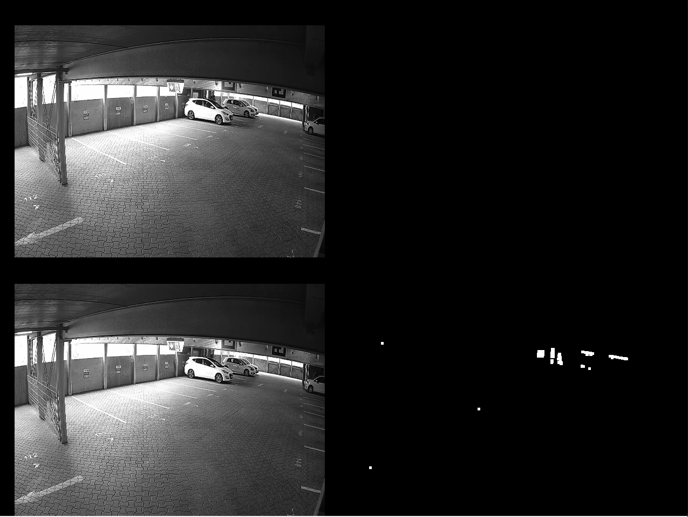
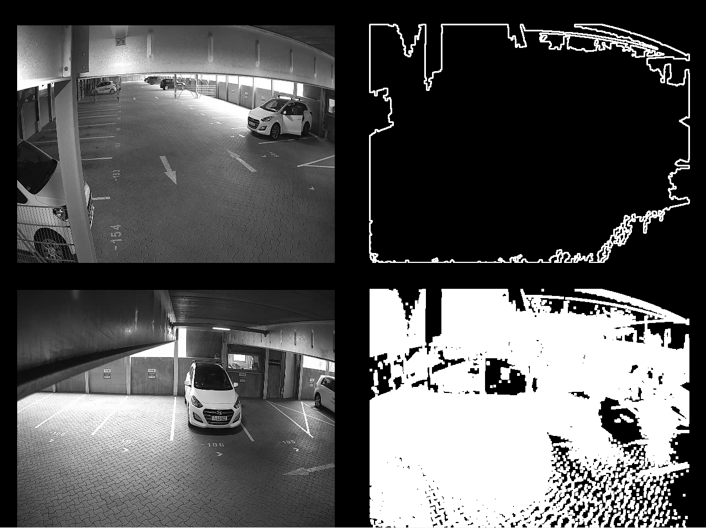

# Dataset Analysis

* The given dataset consists of multiple cameras (3 different IDs) which captured frames at different timestamps.
* The images follow two distinct timestamps: python datetime and unix.
* Illumination conditions vary based on time of the day even though there is no object variance.
* There is a radial distortion in the images (beacuse of angle and the lens).
* In some cases there is heavy occlusion of objects.
* Some images are noise / nonetype.

# Algorithm
## Generic O(n^2) Algo (Slower, more accurate)


The high level overview of this algorithm is as follows:
* Read the file paths of all images in a list.
* Sort the list based on the timestamp.
* Take the first frame and define a window of next frames to compare with.
* If the frame in the window is same as the previous frame, change the current frame to prev frame and analyse the next one in the window.
* Keep a track of how many indices in the window are already evaluated.
* If there is a mismatch, break the window loop and increment the main loop head by that index count.
* Post the execution, run another loop to delete the files from the list.

## O(n) Algo (Faster, less accurate)


The high-level overview of the algorithm is give in the figure above. It consists of the following steps:
* Read the file paths of all the images in a list.
* Sort the list based on the timestamp. This is necessary since images around the same timestamp have higher likelihood to be similar.
* Run a for loop to preprocess the images and compute the delta (using `compare_frames_change_detection`) and append the scores, contours and thresh images as separate lists.
* Run a secondary for loop to compute the difference in the scores as a first pass. If the images are exactly similar, this will hit. Else, check for an acceptable range of tolerance. Also check of the mean of the images are similar, to make sure they are the same images.

# Input Parameters


The idea to determine ideal input parameters depend on the following:
* **Illumination**: In the given data, not only there is a variance in the camera angle but also intensity. This means, the frame differencing algorithm can also give false positive if the scene is exactly the same but the illumination changes.
* **Relative Sizing**: Another core issue regarding rejection of contour is the relative size of the objects. Far away cars have smaller pixel participation, causing less frame difference pixel values.

In order to counter these issues in an automated way, we use a code `tuning_research.py`, that basically works on Kmeans clustering analysis. We do clustering analysis on each contour area (in every image) and overall contour area sum. This gives use the values for `min_area` and a `cut-off` for consideration.

# Data Improvements for Unique Cases
Fundamentally, there are some ways we can improve the data:

* **Illumination Invariance**: Building an algorithm to counter illumination variance. Ideally, a CNN learns to be illumination invariant, however for rejection of similar frames we need to observe and code statistical patterns without increasing the latency.
* **Faster Rejection Cascades**: Remove the unwanted image comparison based on camera ID or date and time.
* **Image Embedding Search**: Use a shallow and accurate model to generate image embeddings and cluster it using libraries like FAISS for faster rejection of similar frames without looping.
* **Working with Parking Geomtry / Geometric Priors**: If we know the areas where cars can be parked and the areas which stay (almost) empty, we can discount the effect of illumination in those regions. While training (based on the archtitecture) these can also account for resolving class imbalance issues.
* **Dynamic Values for thresholding**: Use histogram analysis or Otsu's method to dynamically get the thresholding values.


# Notes to Run the Code

Install poetry
```
$ pip install poetry
```

Navigate to the base dir and install the packages using
```
$ poetry install
```

Spawn a new instance / virtualenv using
```
$ poetry shell
```

run the main file from the base dir
```
$ export PYTHONPATH=.
$ python src/main.py
```

# Additional: Some output from the debug tool

```
Top Left: Prev_frame
Top Right: Contour Image
Bottom Left: Next Frame
Bottom Right: Thresh Image
```

## Similar Images


## Dissimilar Images

