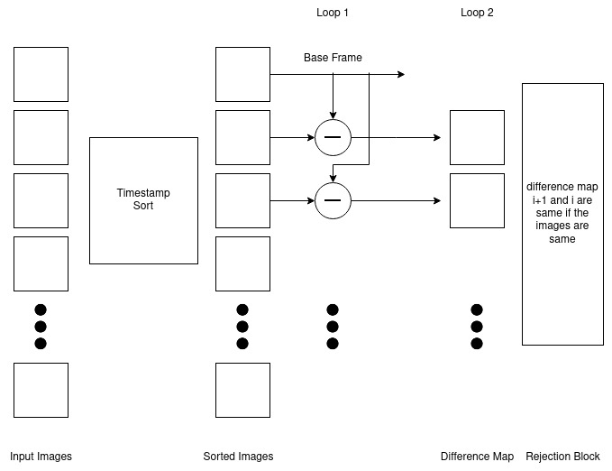

# Dataset Analysis

* The given dataset consists of multiple cameras (3 different IDs) which captured frames at different timestamps.
* The images follow two distinct timestamps: python datetime and unix.
* Illumination conditions vary based on time of the day even though there is no object variance.
* There is a radial distortion in the images (beacuse of angle and the lens).
* In some cases there is heavy occlusion of objects.
* Some images are noise / nonetype.

# Algorithm
